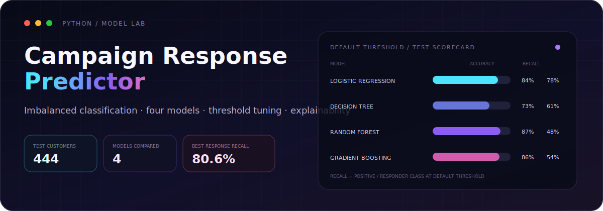
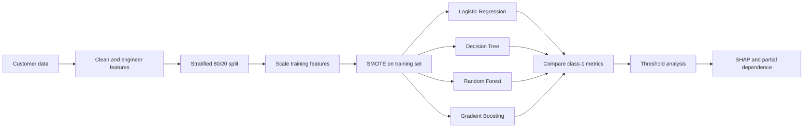

<p align="center">
  
</p>

<p align="center">
  An applied machine-learning study for predicting which customers are likely to respond to a marketing campaign.
</p>

<p align="center">
  <a href="#results">Results</a>&nbsp;&nbsp;·&nbsp;&nbsp;
  <a href="#workflow">Workflow</a>&nbsp;&nbsp;·&nbsp;&nbsp;
  <a href="#run-the-notebook">Run the notebook</a>&nbsp;&nbsp;·&nbsp;&nbsp;
  <a href="#limitations-and-next-steps">Next steps</a>
</p>

## The question

Mass marketing treats every customer the same. This notebook asks a more useful question:

> Given a customer's profile and purchasing behavior, can we identify likely campaign responders while retaining enough recall to make the model useful for targeting?

The work uses the [Customer Personality Analysis dataset](https://www.kaggle.com/datasets/imakash3011/customer-personality-analysis), where the positive response class is much smaller than the non-response class. That imbalance makes raw accuracy an incomplete measure of success.

## What is inside

- Data cleaning and feature preparation with pandas
- One-hot encoding for education and marital-status fields
- Stratified 80/20 train-test split
- Standardization with `StandardScaler`
- Training-only oversampling with SMOTE
- Comparison of Logistic Regression, Decision Tree, Random Forest, and Gradient Boosting
- Threshold search focused on positive-class F1
- SHAP explanations and partial-dependence plots for feature interpretation

## Workflow



## Results

The test set contains **444 customers**: 377 non-responders and 67 responders. The table below reproduces the notebook's stored outputs at the default decision threshold.

| Model | Accuracy | Responder precision | Responder recall | Responder F1 | Notebook ROC-AUC* |
|---|---:|---:|---:|---:|---:|
| **Logistic Regression** | 0.84 | 0.47 | **0.78** | **0.59** | **0.811** |
| Decision Tree | 0.73 | 0.31 | 0.61 | 0.41 | 0.684 |
| Random Forest | **0.87** | **0.59** | 0.48 | 0.53 | 0.710 |
| Gradient Boosting | 0.86 | 0.52 | 0.54 | 0.53 | 0.725 |

<sub>*The current notebook calculates ROC-AUC from predicted classes. A future iteration should calculate it from predicted probabilities for a full ranking-based ROC-AUC.</sub>

### Reading the trade-off

- **Random Forest** has the highest overall accuracy and positive-class precision.
- **Logistic Regression** identifies the largest share of actual responders and produces the strongest positive-class F1 at the default threshold.
- The best choice depends on campaign cost: higher recall reaches more potential responders; higher precision sends fewer low-probability offers.

### Threshold experiment

The notebook searches thresholds from 0.10 to 0.90 and selects the value with the best responder F1 on the current evaluation set.

| Model | Selected threshold | Precision | Recall | F1 |
|---|---:|---:|---:|---:|
| **Logistic Regression** | 0.48 | 0.478 | **0.806** | **0.600** |
| Random Forest | 0.41 | **0.541** | 0.597 | 0.567 |
| Gradient Boosting | 0.33 | 0.456 | 0.776 | 0.575 |

These values are exploratory rather than final production estimates because threshold selection currently uses the test set. A separate validation set or cross-validation should select the threshold before one final test evaluation.

## Class imbalance

The training target distribution is highly uneven:

```text
Before SMOTE: non-response = 1506 | response = 266
After SMOTE:  non-response = 1506 | response = 1506
```

SMOTE is applied after the train-test split, so synthetic examples are created only from training observations and do not enter the held-out test set.

## Explainability

The notebook uses two complementary views:

| Method | Question it helps answer |
|---|---|
| **SHAP summary analysis** | Which features push model predictions most strongly across customers? |
| **Partial-dependence plots** | How does the model's prediction change as a key feature changes? |

The partial-dependence section examines customer tenure, recency, catalogue-purchase ratio, and spending on meat products.

## Run the notebook

### 1. Clone the project

```bash
git clone https://github.com/xrobinx/marketing-campaign-customer-response-predictor.git
cd marketing-campaign-customer-response-predictor
```

### 2. Create an environment

```bash
python -m venv .venv
```

Activate it on macOS/Linux:

```bash
source .venv/bin/activate
```

Activate it on Windows:

```powershell
.\.venv\Scripts\Activate.ps1
```

### 3. Install the notebook dependencies

```bash
pip install pandas numpy matplotlib seaborn scikit-learn imbalanced-learn shap umap-learn joblib jupyter
```

### 4. Add the dataset

Download `marketing_campaign.csv` from [Kaggle](https://www.kaggle.com/datasets/imakash3011/customer-personality-analysis) and place it in the project directory.

The committed notebook currently references the original author's local Windows path. Update the loading cell to:

```python
df = pd.read_csv("marketing_campaign.csv", sep="\t")
```

### 5. Launch

```bash
jupyter notebook "Response prediction.ipynb"
```

## Project structure

```text
marketing-campaign-customer-response-predictor/
├── Response prediction.ipynb  # Analysis, models, evaluation, and interpretation
└── README.md                  # Project narrative and reproducibility guide
```

The dataset is not committed to this repository. Download it directly from the linked Kaggle source and follow its usage terms.

## Limitations and next steps

This is an educational analysis, not a deployed targeting system. The next iteration should:

- Move threshold selection to a validation fold or nested cross-validation
- Calculate ROC-AUC and precision-recall AUC from probabilities
- Package preprocessing and the model in a single scikit-learn pipeline
- Add repeated stratified cross-validation and uncertainty estimates
- Track experiments and persist the chosen model artifact
- Add a cost-based metric tied to campaign economics
- Test fairness and stability across customer segments
- Replace the local dataset path and add a pinned dependency file

Documenting these constraints is part of the project: a model is only useful when its evaluation is reproducible and its limits are visible.

## Author

Built by **Robin**, a Bachelor of Computer Science candidate exploring applied machine learning, explainability, and software engineering.

[GitHub](https://github.com/xrobinx) · [LinkedIn](https://www.linkedin.com/in/robinjeet-singh-151797342/) · [Email](mailto:exowokz@gmail.com)
